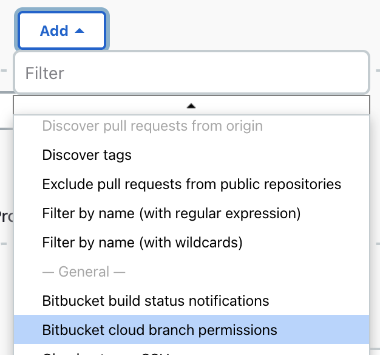
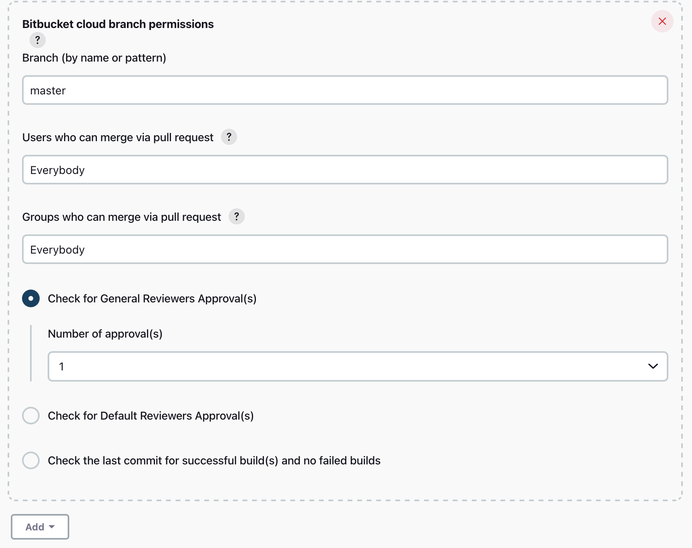

# Bitbucket Branch Restrictions Plugin

Bitbucket Team/Project jobs can scan your Bitbucket organisation and add Bitbucket Branch Restrictions to the scanned repositories.

With this plugin you can 
- Add Users and Groups who can merge the PR to a specific branch.
- Add number of approvals before merging the PR
- Add number of default approvals
- Add number of successful builds.

More information: [Using branch permissions](https://confluence.atlassian.com/bitbucketserver050/using-branch-permissions-913474668.html), [merge checks](https://bitbucket.org/blog/protect-your-master-branch-with-merge-checks).

## How to use the plugin 

1. Go to the configuration of Multibranch pipeline(Organization Folder)
2. From the repository Sources click on Add -> Bitbucket cloud branch permissions
  
The configuration of the branch permissions will open and form here you can: 

* Enter the Branch (by name or pattern) enter the branch that you would like to check 
* Enter the users and groups that can merge via pull request
* You can add the number of general and default approvals 
* The number of last successful builds
  

